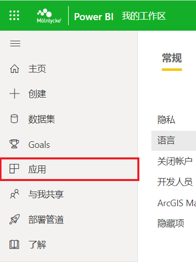

## IMS销售分析报告用户指南

IMS (In Market Sales) 为产品直接到医院的销量，可以更直接的反应产品在市场的情况，也可以反馈市场策略的执行结果. 同时，IMS是考核销售行为结果的数据，同时也是奖金核酸的唯一标准.为了更好的帮助销售代表和经理掌握IMS实际数据以及达成情况，Com-Ex部门推出了 [IMS销售经理分析报告](https://app.powerbi.com/Redirect?action=OpenReport&appId=ce37b19a-4f71-47f2-ab32-1a725e3f3505&reportObjectId=24608c01-62bc-466f-bc6d-3af32ea833ed&ctid=4d3f6608-ec8c-4b1f-9484-274a4b699efb) 来帮助销售核对数据，同时深挖数据背后的信息.

### Quick Access
如果曾经打开过IMS在线报告，可以通过 [PowerBI](https://app.powerbi.com/home) 平台快速访问报告

### 初次访问

#### Step 1: 登录PowerBI

IMS分析报告通过PowerBI在线报告平台发布. PowerBI的使用权限包括在公司提供的 Microsoft 365 服务套餐中，所以无需申请任何权限即可访问. PowerBI平台可以通过多种方式访问:
- [PowerBI](https://app.powerbi.com/home) 主页
- [The Hub](https://molnlycke.omniacloud.net/start) 公司门户
  - 需要连接 VPN 或使用公司内网
  - 选择右上角 - 链接 My Links - China tools and systems - 在线销售分析报告 Power BI
    
- iPad/iPhone端 Power BI应用
  - 通过 Apple App Store 下载 [iOS 应用](https://molnlycke.omniacloud.net/start)

#### Step 2: 访问应用及报告

1. 顺利进入 Power BI 平台后，可以在界面左侧看到导航栏. 选择**应用**
   

2. 在应用界面，点击进入 **CN - ComEx 大中华区商业优化**，同时可以点亮右侧:star:将此应用添加至收藏夹，方便后续访问
   

3. 进入 Com-Ex 应用主界面后，选择 **销售经理IMS分析报告 v2.1** 访问报告
   

### 页面介绍
Your Pages site will use the layout and styles from the Jekyll theme you have selected in your [repository settings](https://github.com/hathaaaway/IMS-Deep-Dive/settings/pages). The name of this theme is saved in the Jekyll `_config.yml` configuration file.

### 操作说明

Having trouble with Pages? Check out our [documentation](https://docs.github.com/categories/github-pages-basics/) or [contact support](https://support.github.com/contact) and we’ll help you sort it out.
